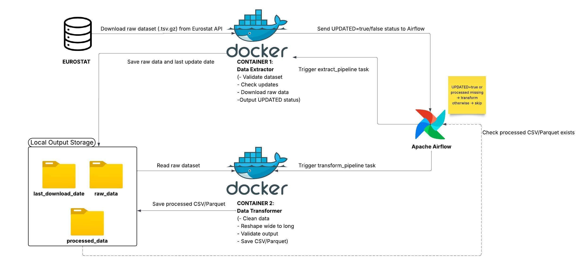

# eurostat-data-pipeline

## Project Overview
The project’s goal is to create an automated data platform that can gather, process, and analyze demographic and
migration data from public sources in Europe, primarily Eurostat. The platform will be automated in a way that
there is no need for manual data downloading, cleaning, and combining every time. The data will be cleaned, reliable,
and ready for analysis, using a clear layered structure inside Microsoft Fabric. The project will also include interactive
Power BI dashboards that make it easy for users to compare different European countries, look at migration patterns,
and see important indicators like asylum applications and migrant ratios. Overall, this project aims to show how
modern data engineering tools can be combined to create a practical, scalable system that helps us better understand
migration patterns in Europe.

---

## Project Goals

- To design and implement a data platform for collecting and managing European migration and demographic data using a modern, automated data lakehouse.
- To develop a fully automated data ingestion and processing pipeline using Docker and Apache Airflow to reliably extract and integrate data from public sources, primarily Eurostat.
- To organize and manage the data using a structured architecture that improves data quality and analytical usability, by using a medallion architecture (Bronze, Silver, Gold layers) within Microsoft Fabric.
- To build interactive visualizations and dashboards using Power BI to explore migration trends, asylum applications, residence permits, and migrant integration indicators across European countries.
- To analyze migration trends and indicators across European countries and explore the use of machine learning techniques for identifying patterns or forecasting migration trends.

---

## Current Architecture Diagram

