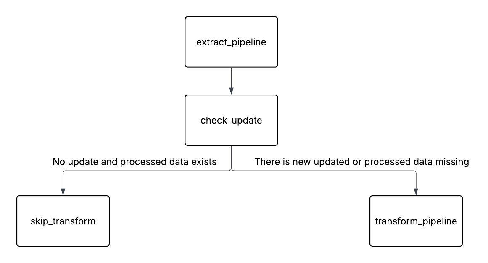

# eurostat-data-pipeline

## Project Overview
The project’s goal is to create an automated data platform that can gather, process, and analyze demographic and
migration data from public sources in Europe, primarily Eurostat. The platform will be automated in a way that
there is no need for manual data downloading, cleaning, and combining every time. The data will be cleaned, reliable,
and ready for analysis, using a clear layered structure inside Microsoft Fabric. The project will also include interactive
Power BI dashboards that make it easy for users to compare different European countries, look at migration patterns,
and see important indicators like asylum applications and migrant ratios. Overall, this project aims to show how
modern data engineering tools can be combined to create a practical, scalable system that helps us better understand
migration patterns in Europe.

---

## Project Goals

- To design and implement a data platform for collecting and managing European migration and demographic data using a modern, automated data lakehouse.
- To develop a fully automated data ingestion and processing pipeline using Docker and Apache Airflow to reliably extract and integrate data from public sources, primarily Eurostat.
- To organize and manage the data using a structured architecture that improves data quality and analytical usability, by using a medallion architecture (Bronze, Silver, Gold layers) within Microsoft Fabric.
- To build interactive visualizations and dashboards using Power BI to explore migration trends, asylum applications, residence permits, and migrant integration indicators across European countries.
- To analyze migration trends and indicators across European countries and explore the use of machine learning techniques for identifying patterns or forecasting migration trends.

---

## Current Architecture Diagram

---

## Pipeline Flow
### 1. Extract Step
The `extract_pipeline` task runs the Dockerized extract container for the selected Eurostat dataset.

The Extractor container: 
- Validates the dataset name and handles empty/null input
- Retrieves the latest update date from Eurostat
- Compares the latest update date with the locally stored date:
* If there is no locally stored date -> Downloads the raw dataset in archived `.tsv.gz` format -> Save the update date from Eurostat locally -> Outputs an update status as the final line (UPDATED=true)
* If the locally stored date is older than the latest Eurostat update date -> Downloads the raw dataset in archived `.tsv.gz` format -> Save the update date from Eurostat locally -> Outputs an update status as the final line (UPDATED=true)
* If the locally stored date equals the latest Eurostat update date -> Skip the download -> Outputs an update status as the final line (UPDATED=false)

The update status is printed as the final output line so that Airflow can read it through XCom and decide whether to run the transform step.

### 2. Update Check 
This task reads the extract status from XCom (UPDATED=false/UPDATED=true) and checks whether the processed CSV and Parquet files already exist, as follows:
* If UPDATED=true -> perform transform_pipeline task
* If the processed output files are missing -> perform transform_pipeline task
* If UPDATED=false and processed output files exist -> Skip transform_pipeline task

### 3. Transform Step
The transform_pipeline task runs the Dockerized transform container.
During this step, the container:
- Reads the raw .tsv.gz dataset that was downloaded from extract_pipeline
- Splits Eurostat dimension columns
- Converts the dataset from wide format to long format
- Cleans numeric values and extracts Eurostat flags
- Applies specific filtering
- Adds country names, and aggregate as derived columns 
- Runs validation checks using DataValidator class to check if required columns exist, if there are columns have null values, if there are negative values in "metric_value" column, and if the time period is not in the correct format
- Saves the transformed output as CSV and Parquet

### 4. Skip Step
If the dataset is already up to date and the processed output files exist, Airflow runs the skip_transform task.

### Pipeline Flow Summary Diagram

---